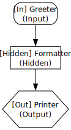
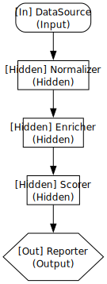
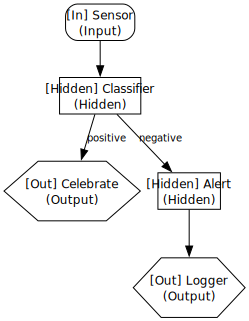
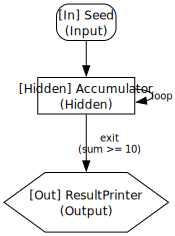
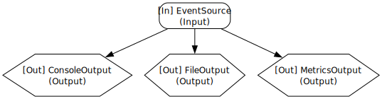
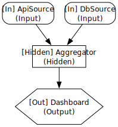
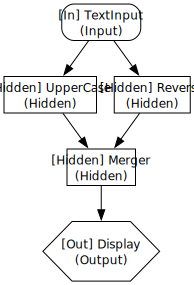
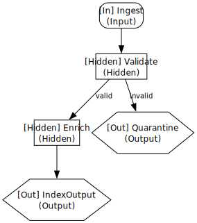
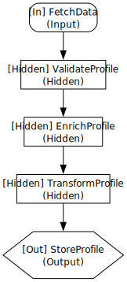
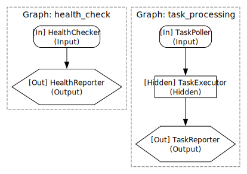

# SmartCrab Examples

This directory contains runnable examples demonstrating various `DirectedGraph` patterns.
Each example includes an SVG visualization in [`figures/`](./figures/).

## Running Examples

```sh
cargo run -p smartcrab --example <example_name>
```

---

## 1. Basic Pipeline

**File:** [`basic_pipeline.rs`](./basic_pipeline.rs)

The simplest graph — a linear Input → Hidden → Output chain.



---

## 2. Multi-Transform

**File:** [`multi_transform.rs`](./multi_transform.rs)

Multiple hidden nodes chained to perform staged data transformations.



---

## 3. Conditional Branch

**File:** [`conditional_branch.rs`](./conditional_branch.rs)

Uses `add_conditional_edge` to route data through different paths based on runtime conditions.



---

## 4. Loop with Exit

**File:** [`loop_with_exit.rs`](./loop_with_exit.rs)

A self-loop (`add_edge("A", "A")`) combined with `add_exit_condition` to repeat processing until a threshold is met.



---

## 5. Fan-Out

**File:** [`fan_out.rs`](./fan_out.rs)

A single input fans out to multiple independent outputs.



---

## 6. Fan-In

**File:** [`fan_in.rs`](./fan_in.rs)

Multiple independent input sources converge into a single processing node.



---

## 7. Diamond

**File:** [`diamond.rs`](./diamond.rs)

A diamond-shaped dependency graph: input splits into parallel branches that converge before the output.



---

## 8. Complex Pipeline

**File:** [`complex_pipeline.rs`](./complex_pipeline.rs)

Combines conditional branching and multi-stage processing in a single graph.



---

## 9. Chatbot

**File:** [`chatbot.rs`](./chatbot.rs)

Simulates an AI chatbot pipeline: message reception → agent processing → response delivery.


---

## 10. Data Enrichment

**File:** [`data_enrichment.rs`](./data_enrichment.rs)

A multi-stage pipeline that fetches, validates, enriches, transforms, and stores user profiles.



---

## 11. Multi-Graph Runtime

**File:** [`multi_graph_runtime.rs`](./multi_graph_runtime.rs)

Uses `Runtime` to execute multiple independent graphs concurrently.



---

## Visualization

The SVG figures were generated using [Graphviz](https://graphviz.org/) DOT format,
matching the output style of `smartcrab viz --format dot`.

Node shapes:
- **Rounded box** — Input node
- **Box** — Hidden node
- **Hexagon** — Output node
