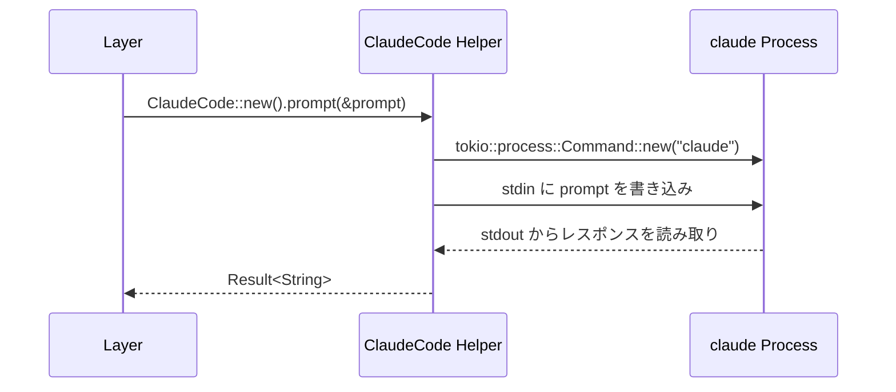
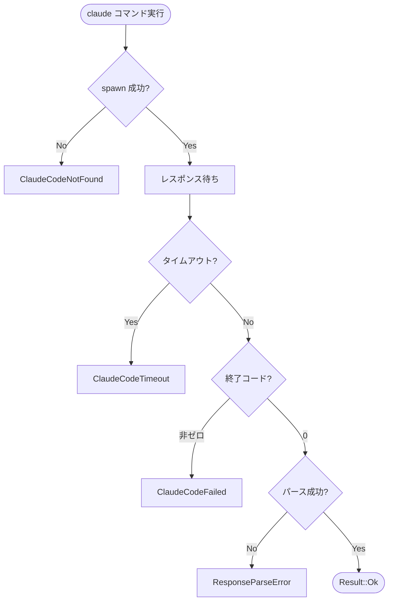

+++
title = "Claude Code Integration"
description = "Claude Code 連携設計 — 子プロセス実行、データ交換、テスト戦略"
weight = 4
+++

## Claude Code の役割

SmartCrab における Claude Code は、Hidden Layer と Output Layer から条件付きで呼び出される AI 処理エンジンである。「ツール → AI」パラダイムの「AI」部分を担う。

Claude Code は以下の場面で使用される:

- **分析・推論**: 非構造化データの解析、自然言語の理解
- **生成**: テキスト生成、コード生成、レポート作成
- **判断**: 複雑な条件判定、分類、優先度付け

## 呼び出しパターン

### 基本パターン



### Hidden Layer での使用

```rust
// DTO → プロンプト → Claude Code → レスポンス → DTO
async fn run(&self, input: Self::Input) -> Result<Self::Output> {
    let prompt = build_prompt(&input);
    let response = ClaudeCode::new()
        .prompt(&prompt)
        .await?;
    parse_response(&response)
}
```

### Output Layer での使用

```rust
// DTO → プロンプト → Claude Code → 副作用（ファイル生成等）
async fn run(&self, input: Self::Input) -> Result<()> {
    let prompt = build_prompt(&input);
    ClaudeCode::new()
        .with_allowed_tools(&["write", "edit"])
        .prompt(&prompt)
        .await?;
    Ok(())
}
```

## `tokio::process::Command` による実行モデル

### 引数構築

```rust
use tokio::process::Command;

pub struct ClaudeCode {
    timeout: Duration,
    allowed_tools: Vec<String>,
    system_prompt: Option<String>,
    max_turns: Option<u32>,
    output_format: OutputFormat,
}

impl ClaudeCode {
    pub fn new() -> Self {
        Self {
            timeout: Duration::from_secs(300),
            allowed_tools: vec![],
            system_prompt: None,
            max_turns: None,
            output_format: OutputFormat::Json,
        }
    }

    pub fn with_timeout(mut self, timeout: Duration) -> Self {
        self.timeout = timeout;
        self
    }

    pub fn with_allowed_tools(mut self, tools: &[&str]) -> Self {
        self.allowed_tools = tools.iter().map(|s| s.to_string()).collect();
        self
    }

    pub fn with_system_prompt(mut self, prompt: impl Into<String>) -> Self {
        self.system_prompt = Some(prompt.into());
        self
    }

    pub fn with_max_turns(mut self, max_turns: u32) -> Self {
        self.max_turns = Some(max_turns);
        self
    }

    pub async fn prompt(&self, prompt: &str) -> Result<String> {
        let mut cmd = Command::new("claude");
        cmd.arg("--print");
        cmd.arg("--output-format").arg(self.output_format.as_str());

        if let Some(ref system) = self.system_prompt {
            cmd.arg("--system-prompt").arg(system);
        }
        for tool in &self.allowed_tools {
            cmd.arg("--allowedTools").arg(tool);
        }
        if let Some(max_turns) = self.max_turns {
            cmd.arg("--max-turns").arg(max_turns.to_string());
        }

        cmd.stdin(std::process::Stdio::piped());
        cmd.stdout(std::process::Stdio::piped());
        cmd.stderr(std::process::Stdio::piped());

        let child = cmd.spawn()?;
        // ... stdin/stdout 処理（後述）
    }
}
```

### stdin / stdout 処理

```rust
let mut child = cmd.spawn()?;

// stdin にプロンプトを書き込み
if let Some(mut stdin) = child.stdin.take() {
    stdin.write_all(prompt.as_bytes()).await?;
    drop(stdin); // EOF を送信
}

// タイムアウト付きで stdout を読み取り
let output = tokio::time::timeout(
    self.timeout,
    child.wait_with_output(),
).await
    .map_err(|_| SmartCrabError::ClaudeCodeTimeout {
        timeout: self.timeout,
    })??;

if !output.status.success() {
    return Err(SmartCrabError::ClaudeCodeFailed {
        exit_code: output.status.code(),
        stderr: String::from_utf8_lossy(&output.stderr).to_string(),
    });
}

Ok(String::from_utf8(output.stdout)?)
```

## データ交換

### DTO → プロンプト変換

DTO を Claude Code に渡すプロンプトに変換する。JSON シリアライズが基本戦略。

```rust
fn build_prompt(input: &impl Dto) -> String {
    let json = serde_json::to_string_pretty(input).unwrap();
    format!(
        "以下のJSONデータを処理してください。結果はJSON形式で返してください。\n\n\
         入力データ:\n```json\n{json}\n```\n\n\
         出力スキーマ:\n```json\n{schema}\n```",
        json = json,
        schema = "{ ... }",
    )
}
```

### レスポンス → DTO パース

Claude Code のレスポンスから DTO を復元する。`--output-format json` で JSON レスポンスを強制し、`serde_json::from_str` でパースする。

```rust
fn parse_response<T: Dto>(response: &str) -> Result<T> {
    // JSON出力フォーマットの場合、result フィールドからテキストを取得
    let claude_output: ClaudeOutput = serde_json::from_str(response)?;
    let dto: T = serde_json::from_str(&claude_output.result)?;
    Ok(dto)
}
```

パースに失敗した場合のフォールバック:

1. JSON ブロック（` ```json ... ``` `）の抽出を試みる
2. それでも失敗した場合は `SmartCrabError::ResponseParseError` を返す

## エラーハンドリング

| エラー種別 | 原因 | エラー型 |
|-----------|------|---------|
| 起動失敗 | `claude` コマンドが見つからない | `SmartCrabError::ClaudeCodeNotFound` |
| タイムアウト | 指定時間内に応答なし | `SmartCrabError::ClaudeCodeTimeout { timeout }` |
| 非ゼロ終了 | Claude Code がエラー終了 | `SmartCrabError::ClaudeCodeFailed { exit_code, stderr }` |
| パースエラー | レスポンスが期待する形式でない | `SmartCrabError::ResponseParseError { response, source }` |



## テスト戦略

### モック化方針

Claude Code の呼び出しを抽象化し、テスト時にモックに差し替えられるようにする。

```rust
#[async_trait]
pub trait ClaudeCodeExecutor: Send + Sync {
    async fn execute(&self, prompt: &str) -> Result<String>;
}

// 本番用
pub struct RealClaudeCode { /* ... */ }

#[async_trait]
impl ClaudeCodeExecutor for RealClaudeCode {
    async fn execute(&self, prompt: &str) -> Result<String> {
        // tokio::process::Command で実際に claude を実行
    }
}

// テスト用
pub struct MockClaudeCode {
    responses: HashMap<String, String>,
}

#[async_trait]
impl ClaudeCodeExecutor for MockClaudeCode {
    async fn execute(&self, prompt: &str) -> Result<String> {
        // 事前に設定したレスポンスを返す
        self.responses.get(prompt)
            .cloned()
            .ok_or(SmartCrabError::MockNotFound)
    }
}
```

### テストレベル

| レベル | 対象 | Claude Code |
|--------|------|-------------|
| ユニットテスト | 個別 Layer | モック |
| 結合テスト | DAG 全体 | モック |
| E2E テスト | アプリケーション全体 | 実際の claude コマンド |

### ユニットテスト例

```rust
#[tokio::test]
async fn test_ai_analysis_layer() {
    let mock = MockClaudeCode::new()
        .with_response(
            r#"{"severity": "high", "summary": "Critical issue found"}"#,
        );

    let layer = AiAnalysis::new_with_executor(mock);
    let input = AnalysisInput {
        data: "test data".to_string(),
    };

    let output = layer.run(input).await.unwrap();
    assert_eq!(output.severity, "high");
}
```
