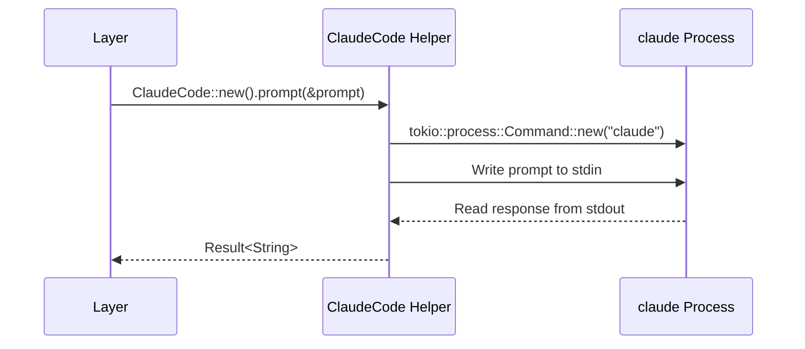
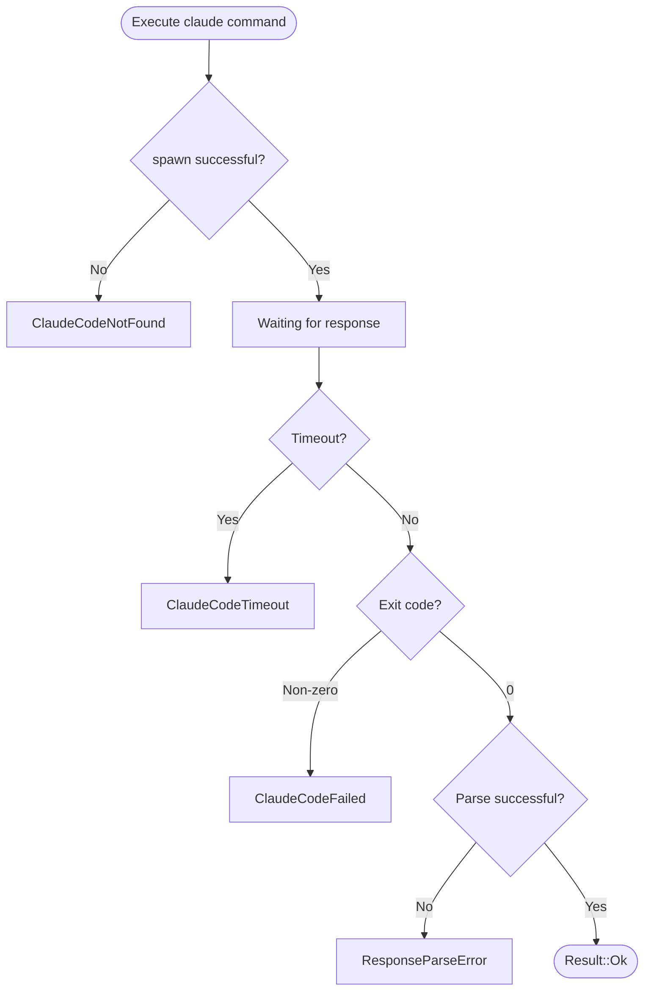

+++
title = "Claude Code Integration"
description = "Claude Code integration design — subprocess execution, data exchange, test strategy"
weight = 4
+++

## Role of Claude Code

In SmartCrab, Claude Code is the AI processing engine conditionally invoked from Hidden Layers and Output Layers. It fulfills the "AI" part of the "Tool-to-AI" paradigm.

Claude Code is used in the following scenarios:

- **Analysis & Reasoning**: Parsing unstructured data, understanding natural language
- **Generation**: Text generation, code generation, report creation
- **Decision-making**: Complex condition evaluation, classification, prioritization

## Invocation Patterns

### Basic Pattern



### Usage in a Hidden Layer

```rust
// DTO → prompt → Claude Code → response → DTO
async fn run(&self, input: Self::Input) -> Result<Self::Output> {
    let prompt = build_prompt(&input);
    let response = ClaudeCode::new()
        .prompt(&prompt)
        .await?;
    parse_response(&response)
}
```

### Usage in an Output Layer

```rust
// DTO → prompt → Claude Code → side effect (file generation, etc.)
async fn run(&self, input: Self::Input) -> Result<()> {
    let prompt = build_prompt(&input);
    ClaudeCode::new()
        .with_allowed_tools(&["write", "edit"])
        .prompt(&prompt)
        .await?;
    Ok(())
}
```

## Execution Model via `tokio::process::Command`

### Argument Construction

```rust
use tokio::process::Command;

pub struct ClaudeCode {
    timeout: Duration,
    allowed_tools: Vec<String>,
    system_prompt: Option<String>,
    max_turns: Option<u32>,
    output_format: OutputFormat,
}

impl ClaudeCode {
    pub fn new() -> Self {
        Self {
            timeout: Duration::from_secs(300),
            allowed_tools: vec![],
            system_prompt: None,
            max_turns: None,
            output_format: OutputFormat::Json,
        }
    }

    pub fn with_timeout(mut self, timeout: Duration) -> Self {
        self.timeout = timeout;
        self
    }

    pub fn with_allowed_tools(mut self, tools: &[&str]) -> Self {
        self.allowed_tools = tools.iter().map(|s| s.to_string()).collect();
        self
    }

    pub fn with_system_prompt(mut self, prompt: impl Into<String>) -> Self {
        self.system_prompt = Some(prompt.into());
        self
    }

    pub fn with_max_turns(mut self, max_turns: u32) -> Self {
        self.max_turns = Some(max_turns);
        self
    }

    pub async fn prompt(&self, prompt: &str) -> Result<String> {
        let mut cmd = Command::new("claude");
        cmd.arg("--print");
        cmd.arg("--output-format").arg(self.output_format.as_str());

        if let Some(ref system) = self.system_prompt {
            cmd.arg("--system-prompt").arg(system);
        }
        for tool in &self.allowed_tools {
            cmd.arg("--allowedTools").arg(tool);
        }
        if let Some(max_turns) = self.max_turns {
            cmd.arg("--max-turns").arg(max_turns.to_string());
        }

        cmd.stdin(std::process::Stdio::piped());
        cmd.stdout(std::process::Stdio::piped());
        cmd.stderr(std::process::Stdio::piped());

        let child = cmd.spawn()?;
        // ... stdin/stdout handling (see below)
    }
}
```

### stdin / stdout Handling

```rust
let mut child = cmd.spawn()?;

// Write prompt to stdin
if let Some(mut stdin) = child.stdin.take() {
    stdin.write_all(prompt.as_bytes()).await?;
    drop(stdin); // Send EOF
}

// Read stdout with timeout
let output = tokio::time::timeout(
    self.timeout,
    child.wait_with_output(),
).await
    .map_err(|_| SmartCrabError::ClaudeCodeTimeout {
        timeout: self.timeout,
    })??;

if !output.status.success() {
    return Err(SmartCrabError::ClaudeCodeFailed {
        exit_code: output.status.code(),
        stderr: String::from_utf8_lossy(&output.stderr).to_string(),
    });
}

Ok(String::from_utf8(output.stdout)?)
```

## Data Exchange

### DTO → Prompt Conversion

DTOs are converted into prompts to be passed to Claude Code. JSON serialization is the primary strategy.

```rust
fn build_prompt(input: &impl Dto) -> String {
    let json = serde_json::to_string_pretty(input).unwrap();
    format!(
        "Please process the following JSON data and return the result in JSON format.\n\n\
         Input data:\n```json\n{json}\n```\n\n\
         Output schema:\n```json\n{schema}\n```",
        json = json,
        schema = "{ ... }",
    )
}
```

### Response → DTO Parsing

DTOs are restored from Claude Code responses. `--output-format json` forces a JSON response, which is then parsed with `serde_json::from_str`.

```rust
fn parse_response<T: Dto>(response: &str) -> Result<T> {
    // For JSON output format, get text from the result field
    let claude_output: ClaudeOutput = serde_json::from_str(response)?;
    let dto: T = serde_json::from_str(&claude_output.result)?;
    Ok(dto)
}
```

Fallback when parsing fails:

1. Attempt to extract a JSON block (` ```json ... ``` `)
2. If that also fails, return `SmartCrabError::ResponseParseError`

## Error Handling

| Error Type | Cause | Error Kind |
|-----------|------|---------|
| Launch failure | `claude` command not found | `SmartCrabError::ClaudeCodeNotFound` |
| Timeout | No response within the specified time | `SmartCrabError::ClaudeCodeTimeout { timeout }` |
| Non-zero exit | Claude Code exits with an error | `SmartCrabError::ClaudeCodeFailed { exit_code, stderr }` |
| Parse error | Response is not in the expected format | `SmartCrabError::ResponseParseError { response, source }` |



## Test Strategy

### Mocking Approach

Abstract the Claude Code invocation so it can be replaced with a mock during testing.

```rust
#[async_trait]
pub trait ClaudeCodeExecutor: Send + Sync {
    async fn execute(&self, prompt: &str) -> Result<String>;
}

// Production implementation
pub struct RealClaudeCode { /* ... */ }

#[async_trait]
impl ClaudeCodeExecutor for RealClaudeCode {
    async fn execute(&self, prompt: &str) -> Result<String> {
        // Actually execute claude via tokio::process::Command
    }
}

// Test implementation
pub struct MockClaudeCode {
    responses: HashMap<String, String>,
}

#[async_trait]
impl ClaudeCodeExecutor for MockClaudeCode {
    async fn execute(&self, prompt: &str) -> Result<String> {
        // Return a pre-configured response
        self.responses.get(prompt)
            .cloned()
            .ok_or(SmartCrabError::MockNotFound)
    }
}
```

### Test Levels

| Level | Scope | Claude Code |
|--------|------|-------------|
| Unit test | Individual Layer | Mock |
| Integration test | Full DAG | Mock |
| E2E test | Full application | Real claude command |

### Unit Test Example

```rust
#[tokio::test]
async fn test_ai_analysis_layer() {
    let mock = MockClaudeCode::new()
        .with_response(
            r#"{"severity": "high", "summary": "Critical issue found"}"#,
        );

    let layer = AiAnalysis::new_with_executor(mock);
    let input = AnalysisInput {
        data: "test data".to_string(),
    };

    let output = layer.run(input).await.unwrap();
    assert_eq!(output.severity, "high");
}
```
