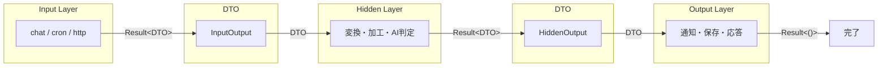
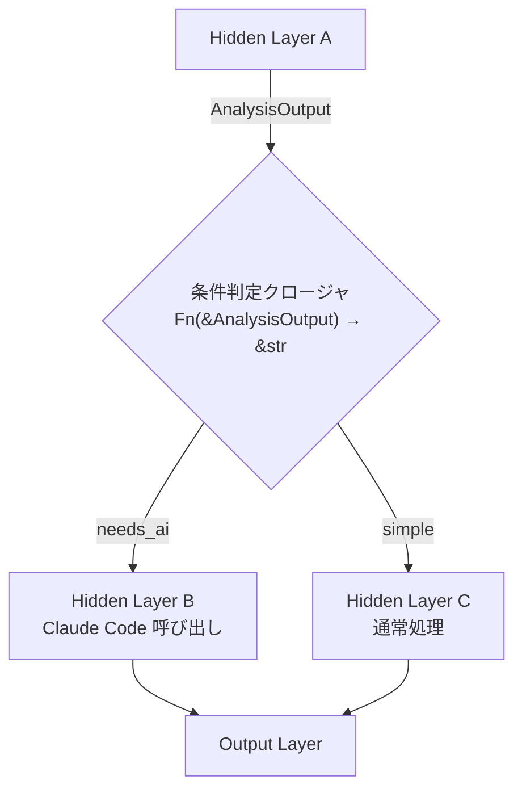
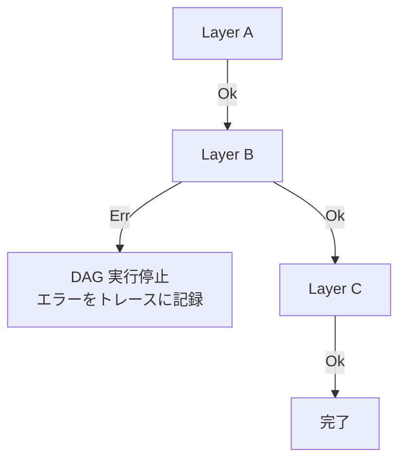

+++
title = "Data Flow"
description = "データフロー設計 — Layer 間のデータの流れ、型安全性、エラーハンドリング"
weight = 2
+++

## 全体フロー

SmartCrab のデータフローは Input → DTO → Hidden → DTO → Output の流れで構成される。各 Layer 間のデータ受け渡しは型安全な DTO を介して行われる。



## Layer のシグネチャ設計

各 Layer はジェネリクスで入出力の DTO 型を指定する。

```rust
// Input Layer: 入力なし → DTO を生成
#[async_trait]
pub trait InputLayer: Send + Sync {
    type Output: Dto;
    async fn run(&self) -> Result<Self::Output>;
}

// Hidden Layer: DTO を受け取り → DTO を返す
#[async_trait]
pub trait HiddenLayer: Send + Sync {
    type Input: Dto;
    type Output: Dto;
    async fn run(&self, input: Self::Input) -> Result<Self::Output>;
}

// Output Layer: DTO を受け取り → 副作用を実行
#[async_trait]
pub trait OutputLayer: Send + Sync {
    type Input: Dto;
    async fn run(&self, input: Self::Input) -> Result<()>;
}
```

## 条件分岐におけるデータフロー

条件付きエッジでは、先行 Layer の出力 DTO を参照して分岐先を決定する。クロージャはDTO の参照を受け取り、分岐先の識別子を返す。



### 条件クロージャのシグネチャ

```rust
// 条件クロージャは DTO の参照を受け取り、分岐先のエッジラベルを返す
Fn(&dyn Dto) -> &str
```

条件クロージャが返す文字列は `add_conditional_edge` で定義した分岐先マップのキーに対応する。

## エラーハンドリング戦略

エラーは 2 つのレベルで処理される。

### Layer 内エラー

各 Layer の `run` メソッドは `Result` を返す。Layer 内で発生するエラーは Layer の責務で適切な `Error` 型に変換する。

```rust
// Layer 内でのエラーハンドリング例
async fn run(&self, input: Self::Input) -> Result<Self::Output> {
    let response = self.client.get(&input.url)
        .await
        .map_err(|e| SmartCrabError::LayerExecution {
            layer: "FetchData",
            source: e.into(),
        })?;
    // ...
}
```

### DAG レベルエラー

Layer が `Err` を返した場合、DAG エンジンは実行を停止し、エラーを呼び出し元に伝播する。



- エラー発生時、該当 Layer の span にエラー情報が記録される
- DAG は即座に実行を停止する（後続の Layer は実行されない）
- 他の DAG の実行には影響しない（DAG 間は独立）

## 型安全性の保証範囲

### コンパイル時保証

- 各 Layer の `Input` / `Output` 関連型による DTO 型の一致
- `Dto` トレイトの derive 要件（`Serialize`, `Deserialize`, `Clone`, `Send`, `Sync`）

### 実行時検証

- DAG ビルド時のエッジの型整合性チェック（隣接 Layer の Output 型と Input 型の一致）
- 条件分岐の網羅性チェック（全分岐先が存在するか）
- DAG の構造検証（循環検出、到達不能ノード検出）

```
コンパイル時                     実行時（DAG ビルド時）
┌─────────────────────┐      ┌──────────────────────────┐
│ Layer の型パラメータ  │      │ エッジの型整合性           │
│ Dto の derive 要件    │      │ 条件分岐の網羅性           │
│ Send + Sync 境界     │      │ DAG 構造検証（循環、到達性） │
└─────────────────────┘      └──────────────────────────┘
```

型パラメータによる静的チェックで可能な範囲の安全性をコンパイル時に保証し、DAG のグラフ構造に関する検証は `build()` 時に実行時チェックとして行う。
