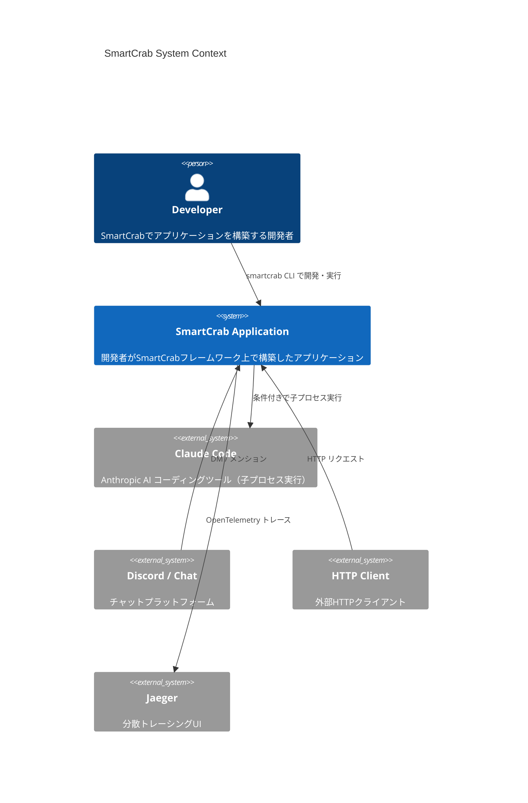
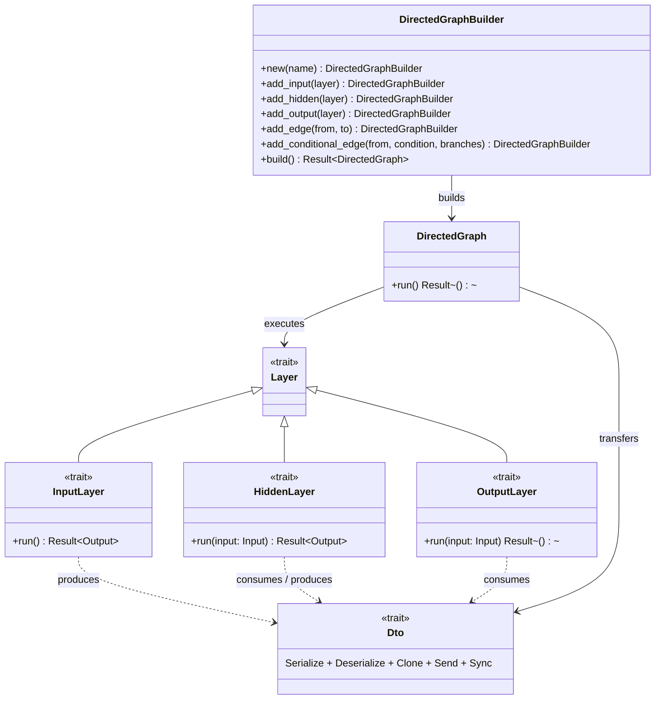
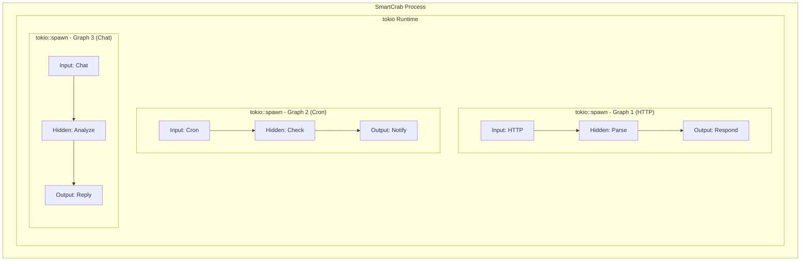

# Architecture

## 「ツール → AI」パラダイム

従来の AI エージェントフレームワーク（OpenClaw 等）は「AI → ツール」パラダイムに基づいている。AI が主導し、必要に応じてツールを呼び出す。

SmartCrab はこれを逆転させた「ツール → AI」パラダイムを採用する。通常の処理（HTTP リクエスト処理、Cron ジョブ、チャットメッセージ受信等）を先に実行し、その結果に基づいて AI を呼び出すかどうかを条件分岐で判断する。

```
従来: AI → ツール
  ┌──────┐    ┌──────┐    ┌──────┐
  │  AI  │───▶│ Tool │───▶│  AI  │───▶ ...
  └──────┘    └──────┘    └──────┘
  AIが主導し、ツールを呼び出す

SmartCrab: ツール → AI
  ┌──────┐    ┌───────────┐    ┌──────────────┐
  │Input │───▶│ 条件判定  │───▶│ Claude Code  │───▶ ...
  └──────┘    └───────────┘    └──────────────┘
  非AI処理が先行し、条件に応じてAIを起動する
```

このアプローチの利点:

- **コスト効率**: AI は必要な場合のみ起動される
- **予測可能性**: 非 AI 処理は決定論的に動作する
- **テスタビリティ**: AI を含まない処理パスは通常のユニットテストで検証できる
- **制御性**: AI の起動条件をプログラマが明示的に定義できる

## システム全体像



## 3 要素の関係

SmartCrab アプリケーションは **Layer**、**DTO**、**Graph** の 3 要素で構成される。



- **Layer**: 処理の最小単位。Input / Hidden / Output の 3 種
- **DTO**: Layer 間のデータ受け渡しに使う型安全な構造体
- **Graph**: Layer の実行順序と条件分岐を定義するグラフ

## 並行実行モデル

SmartCrab は 1 プロセスで複数の Graph を同時実行する。tokio ランタイム上で各 Graph が独立した非同期タスクとして動作する。



- 各 Graph は `tokio::spawn` で独立したタスクとして実行される
- Graph 内の Layer は Graph が定義する順序で逐次実行される（並列エッジがある場合は並列実行）
- Claude Code の呼び出しは `tokio::process::Command` で非同期に実行される
- グレースフルシャットダウンは `tokio::signal` でシグナル（SIGTERM / SIGINT）を受けて全 Graph に伝播する

## オブザーバビリティ

SmartCrab は OpenTelemetry を用いた構造化トレーシングを標準装備する。

### Span 構造

```
smartcrab                          # Root span
├── graph::{graph_name}            # Graph実行のspan
│   ├── layer::{layer_name}        # 各Layerの実行span
│   │   ├── claude_code::invoke    # Claude Code呼び出し（該当する場合）
│   │   └── ...
│   ├── edge::{from}→{to}         # エッジ遷移のspan
│   │   └── condition::evaluate    # 条件評価（条件付きエッジの場合）
│   └── ...
└── ...
```

### トレース送信先

現在の構成では Jaeger に OTLP gRPC でトレースを送信する（`compose.yml` 参照）。

| コンポーネント | ポート | 用途 |
|---------------|--------|------|
| Jaeger UI | 16686 | トレースの可視化 |
| OTLP gRPC | 4317 | トレースの受信 |

## デプロイメント

### Docker 構成

マルチステージビルドにより最小限のプロダクションイメージを生成する。

```
Stage 1: chef      — cargo-chef インストール
Stage 2: planner   — recipe.json 生成（依存キャッシュ用）
Stage 3: builder   — 依存ビルド → アプリケーションビルド
Stage 4: runtime   — distroless イメージに静的バイナリのみコピー
```

- ベースイメージ: `gcr.io/distroless/static-debian12:nonroot`
- ビルドキャッシュ: cargo registry / git / target ディレクトリをマウントキャッシュ
- リリース最適化: `codegen-units = 1`, `lto = true`, `strip = true`
